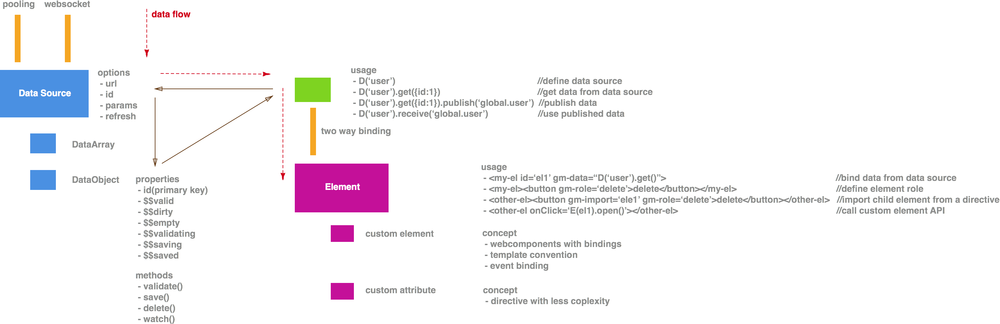
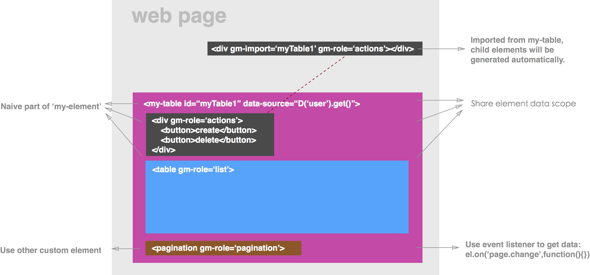

# Gilgamesh

Gilgamesh is a collection of useful plugins and extensions based on AngularJS( Polymer version is coming soon) to help you build modern web application.
Run a local web server and browse to http://127.0.0.1/runner-angular.html to see demo.

## 1. Architecture



## 2. Usage

### 2.1 Data Source

#### 2.1.1 Get a list

```
D("user").get()                    //get user list
D("user").get({name:"Gilgamesh"})  //get user list with parameters
```

#### 2.1.2 Get a certain object

```
//id can be replace by any name you defined as primary key
D("user").get({id:1})  
D("user").get(1) 
```

#### 2.1.3 Create a new object and save it

```
var newUser = D("user").new()
newUser.name = "me"
newUser.save()
```

#### 2.1.4 Publish data with a name

```
D("user").get(id).publish("global.user")
D("user").receive("global.user")
```

#### 2.1.5 Available data status and methods

```
$$filled    //is data filled from ajax data
$$valid     //need method validate implemented
$$dirty		//is data changed?
$$empty		//is data equal to undefined, null, or "".
$$validating
$$validated
$$saving
$$saved
$$actions   //map of current action status. example: {"saving":false,"saved":"true","deleting":true}
```

```
.validate()  					//need to be validate manually
.delete()
.save()
.watch("attribute", callback)  //watch certain attribute
.watch(callback)				//watch object
.notify()						//manualy call watch callbacks
```

#### 2.1.6 Execute actions

Actions will generate `PUT` http request with url "/{id}/{action}". Example:

```
D("user").get(id).action("doSomething")({/*parameters*/})
```

Batch Actions example:
```
D("user").get({name:"Gilgamesh"}.action("batchAction")(params).

D("user").get({name:"Gilgamesh"}.filter("id",[ids]).action("batchAction")(params).

//or you can use it via DataSource directly. The difference is that actions on
//collection will change the status of current collection.
D("user").action("batchAction")(params)
```

#### 2.1.7 Overwrite an action

```
D("user").action("doSomething",function( instanceOrCollections, params, dataSource ){
    //return setting to overwrite default ajax settings
    return {
        url : "/url",
        method : "POST",
        data : {}
        success : function( res ){
            dataSource.parse(res)
        }
    }
})
```


### 2.2 Element

#### 2.2.1 Use it with Data Source


	<div gm-data="D('user').get(1) as user">
		name   : <input type="text" ng-model="user.name">
		gender : <input type="text" ng-model="user.gender">
		<button ng-click="user.save()">save</button>
	</div>

#### 2.2.2 Use template overwrite

First, use `gmDirective` instead of `directive`:

```
.gmDirective("userCardForm", function(){
    return {
      //require : "gmSource",
      priority : 98,
      template:
      '	   <div gm-role="input">'+
      '    		<input type="text" ng-model="user.name">'+
      '    		<input type="text" ng-model="user.gender">'+
      '	   </div>'+
      '    <button gm-role="save" ng-click="user.save()">save</button>'
      link : function( $scope, $el, $attrs){
        console.log("watch $$saved")
          $scope.user.watch("$$saved", function( saved ){
            if( saved ){
              try{
                if($el.attr('onSubmit') ) (new Function( $el.attr('onSubmit')))()
                console.log( $el.attr('onSubmit'))
                console.log( "on submit", saved)

              }catch(e){
                console.log( e )
              }
            }
          })
      }
    }
  })
```

Secondly, overwrite template with child element:

	<div user-card-form gm-data="D('user').new() as user">
        name : <input type="text" ng-model="user.name">
        gender : <input type="text" ng-model="user.gender">
        <button role="save" ng-click="user.save()">save</button>
        <div>saving : {{user.$$saving}}</div>
        <div>saved : {{user.$$saved}}</div>
    </div>

#### 2.2.3 Overwrite part of template

As you may notice that a extra attribute `gm-role` was added to child element of directive `user-card-form`. We can do partial overwriting with `gm-tpl` set to `include`:


	<div user-card-form gm-tpl-include gm-data="D('user').new() as user" >
        <button role="save" ng-click="user.save()">only changed button</button>
    </div>

What if you only want to exclude certain part? For instance, We can exlude the save button like:

	<div user-card-form gm-tpl-exclude="save" gm-data="D('user').new() as user" ></div>

#### 2.2.4 Import child element from a directive

Magic here, We can break the fence of html structure. Surpose we need to place the save button outside the `user-card-form` due to some insane reason, we simply do:

	<button gm-import="newUser" gm-role="save">save from outside</button>
	<div id="newUser" user-card-form gm-data="D('user').new() as user" ></div>

`gm-import` is used to specify the id of which element you want to import from, and  `gm-role` is used to identify the import part.

#### 2.2.5 Import directive's scope

In some cases interaction between directives requires a lot of api or event, and sharing scope would make it much easier. We cant still use `gm-import` to do that.

	<div gm-import="newUser">{{user.name}}</div>
	<div id="newUser" user-card-form gm-data="D('user').new() as user" ></div> 

## 3. Conventions

### 3.1 Expose api on element

Api should be exposed on element.

### 3.2 Use gm-src on the right element

We provided various ways like role-based element import for cases require scope or method sharing, please use it instead of lifting angular scope.

### 3.3 Invoke callbacks and trigger event like build-in element

As title says, for example, implementing attribute `onSubmit` on a custom form would be the right way to invoke callback.

## 4. Demo

### 4.1 How to use a modal to wrap a form.

**Directives**

```
.gmDirective( "myModal", function(){
    return {
      link : function( $scope, $el, $attrs ){
        $el.css({/*your modal css*/})

        $el[0].open = function(){
          $el.show()
        }

        $el[0].hide = function(){
          console.log("closing")
          $el.hide()
        }
        
        $el.hide()
      }
    }
  })
```

```
.gmDirective("userCardForm", function(){
    return {
      template:
      '<div role="input">'+
      '    <input type="text" ng-model="user.name">'+
      '    <input type="text" ng-model="user.gender">'+
      '</div>'+
      '<button role="save" ng-click="user.save()">save</button>',
      link : function( $scope, $el, $attrs){
          $scope.user.watch("$$saved", function( saved ){
			saved && $el.attr('onSubmit') ) && (new Function( $el.attr('onSubmit')))()
          })
      }
    }
  })
```

**HTML**

	<button onClick="el('ecs-create-modal').open()">open modal</button>

    <my-modal id="ecs-create-modal">
    
    	<modal-body>
	        <div id="userCard" gm-source="D('user').new() as user" gm-tpl-exclude="save" onSubmit="el('ecs-create-modal').hide()"></div>
    	</modal-body>
    	
    	<modal-foot>
        <button gm-import="userCard" gm-role="save">save</button>
	    </modal-foot>
	    
    </my-modal>

### 4.2 A custom element explaining `gm-import`

  

## 5. Todo

  - [ ] Polymer support
  - [ ] React support
  - [ ] Event system